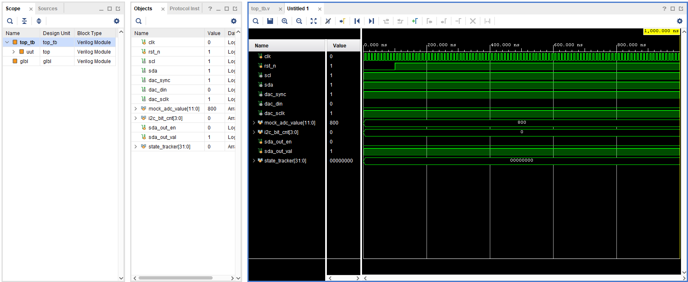
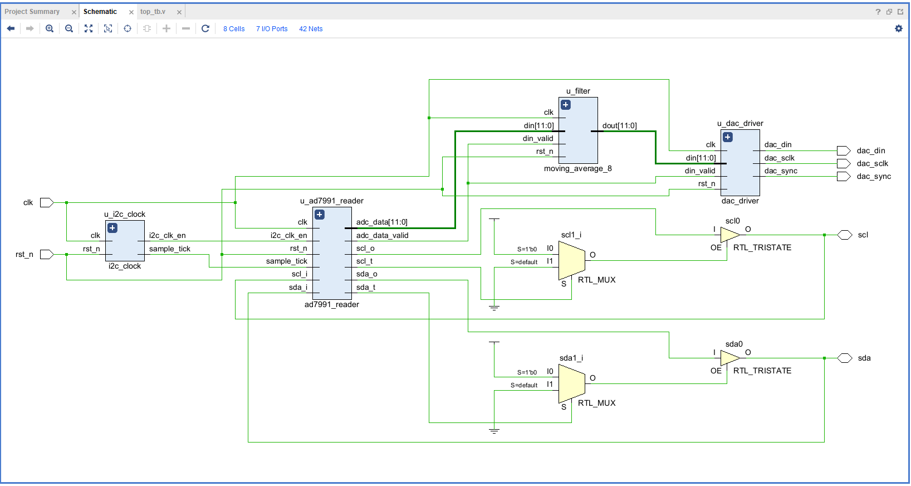
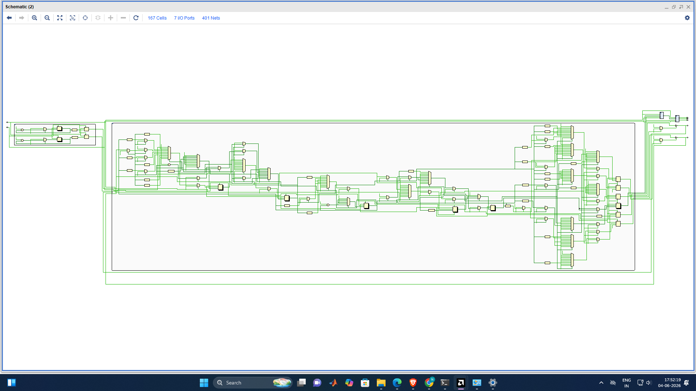
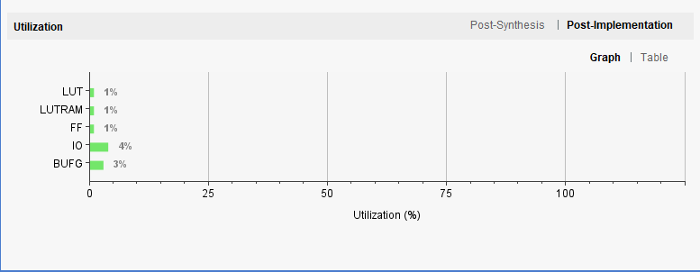
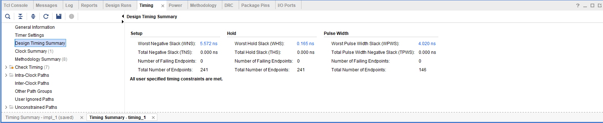
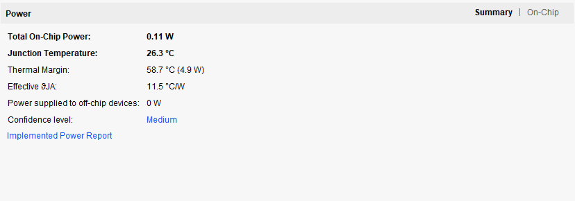
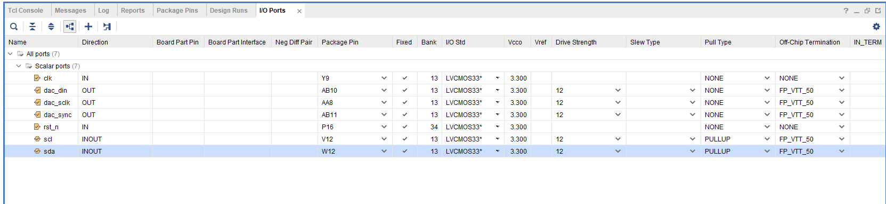
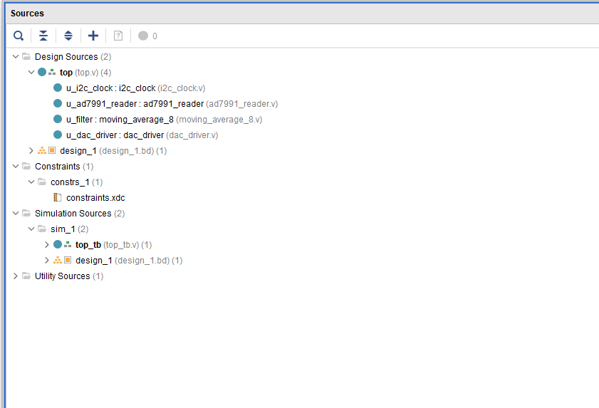

# Moving average filter 

## 📌 Overview

This project implements an 8-Point Moving Average Filter using Verilog HDL on a ZedBoard FPGA. The filter processes sampled input data and generates a smoother output signal by reducing noise. The design demonstrates basic digital signal processing concepts and real-time FPGA implementation.

## 📜 Problem Statement

Design and implement an 8-Point Moving Average Filter (MAF) on an FPGA to reduce noise from a sampled input signal.

* Acquire input samples from an ADC.
* Store the current and previous seven samples.
* Compute the average of the latest eight samples.
* Generate a smoother output signal with reduced noise.
* Transmit the filtered data to a DAC for analog signal reconstruction.
* Demonstrate real-time digital signal processing using FPGA hardware.
****

## ✨ Features

### Signal Acquisition

* Acquires analog signals using the PMOD AD2 (AD7991 ADC).
* Converts analog input into 12-bit digital samples.
* Supports real-time data acquisition at a sampling rate of 1 kHz.

### Noise Reduction

* Implements an 8-Point Moving Average Filter.
* Reduces random noise present in the input signal.
* Produces a smoother and more stable output waveform.

### Real-Time Processing

* Processes incoming samples continuously inside the FPGA.
* Generates filtered output without noticeable delay.
* Demonstrates real-time digital signal processing (DSP).

### Signal Reconstruction

* Sends filtered digital data to the PMOD DA2 DAC.
* Converts filtered digital samples back into an analog signal.
* Allows direct observation of the filtered waveform on an oscilloscope.

### FPGA Implementation

* Designed entirely using Verilog HDL.
* Implemented and tested on a ZedBoard FPGA.
* Uses modular design for easy debugging and future upgrades.

---

## 🛠 Tools & Hardware
- Software: Vivado ML Edition (Standard) 2024.2
- Hardware: ZedBoard Zynq-7000 ARM / FPGA SoC Development Board
- Pmod AD2 and Pmod DA2 convertors 
---

## 🔌 Inputs & Outputs

| Signal Name   | Direction | Description                                       |
| ------------- | --------- | ------------------------------------------------- |
| clk           | Input     | 100 MHz system clock from ZedBoard                |
| i2c_sda       | Inout     | I²C data line connected to PMOD AD2 (AD7991 ADC)  |
| i2c_scl       | Output    | I²C clock line for ADC communication              |
| dac_sync      | Output    | DAC chip select (SYNC) signal                     |
| dac_sclk      | Output    | DAC serial clock signal                           |
| dac_din       | Output    | DAC serial data input signal                      |
| adc_data      | Internal  | 12-bit digital sample received from ADC           |
| filtered_data | Internal  | 12-bit filtered output from Moving Average Filter |
| raw_data      | Internal  | Raw ADC conversion data before filtering          |
| sample_tick   | Internal  | 1 kHz sampling pulse generated by FPGA            |

---

## 🔄 Filter Operation

The system continuously samples the input signal through the AD7991 ADC.

Each new ADC sample is stored in a shift register containing the latest eight samples.

When a new sample arrives:

* The oldest sample is removed.
* The newest sample is added.
* The sum of all eight samples is updated.

The FPGA then calculates the average of these eight samples by dividing the accumulated sum by 8.

The resulting average value becomes the filtered output and is transmitted to the DAC for analog signal reconstruction.

✅ In short:

New Sample Arrives → Update 8-Sample Window → Calculate Average → Send Filtered Data to DAC

---
## 🔄 Data Flow Diagram

```text
Noisy Analog Signal
         │
         ▼
   PMOD AD2
   (AD7991 ADC)
         │
         ▼
  ADC Data Reader
         │
         ▼
  8-Point Moving
  Average Filter
         │
         ▼
    DAC Driver
         │
         ▼
    PMOD DA2
       DAC
         │
         ▼
 Filtered Analog
      Output
```
## 🔄 AD7991 Reader State Diagram

```text
IDLE
  │
  ▼
START
  │
  ▼
SEND_ADDRESS
  │
  ▼
WAIT_ACK
  │
  ▼
READ_BYTE1
  │
  ▼
READ_BYTE2
  │
  ▼
STOP
  │
  ▼
IDLE
```
## 📂 top.v
```text 
top.v
 ├─ controls everything
 ├─ calls i2c_clock
 ├─ calls ad7991_reader
 ├─ calls moving_average_8
 └─ calls dac_driver
```
 ``` verilog
`timescale 1ns / 1ps

module top (
    input  wire       clk,        // 100 MHz clock from Y9
    input  wire       rst_n,      // Active-low reset from P16
    // PMOD AD2 (I2C)
    inout  wire       scl,        
    inout  wire       sda,        
    // PMOD DA2 (SPI)
    output wire       dac_sync,   // AB11
    output wire       dac_din,    // AB10
    output wire       dac_sclk    // AA8
);

    // Internal Global Signals
    wire        i2c_clk_en;
    wire        sample_tick;
    wire [11:0] adc_data;
    wire        adc_data_valid;
    wire [11:0] filtered_data;
    
    // Tristate control for I2C SDA
    wire sda_i;
    wire sda_o;
    wire sda_t;
    assign sda = (sda_t == 1'b0) ? sda_o : 1'bZ;
    assign sda_i = sda;

    // Tristate control for I2C SCL
    wire scl_i;
    wire scl_o;
    wire scl_t;
    assign scl = (scl_t == 1'b0) ? scl_o : 1'bZ;
    assign scl_i = scl;

    // 1. Clock and Timing Generator
    i2c_clock u_i2c_clock (
        .clk(clk),
        .rst_n(rst_n),
        .i2c_clk_en(i2c_clk_en),
        .sample_tick(sample_tick)
    );

    // 2. AD7991 ADC I2C Reader
    ad7991_reader u_ad7991_reader (
        .clk(clk),
        .rst_n(rst_n),
        .i2c_clk_en(i2c_clk_en),
        .sample_tick(sample_tick),
        .adc_data(adc_data),
        .adc_data_valid(adc_data_valid),
        .scl_i(scl_i),
        .scl_o(scl_o),
        .scl_t(scl_t),
        .sda_i(sda_i),
        .sda_o(sda_o),
        .sda_t(sda_t)
    );

    // 3. 8-Point Moving Average Filter
    moving_average_8 u_filter (
        .clk(clk),
        .rst_n(rst_n),
        .din(adc_data),
        .din_valid(adc_data_valid),
        .dout(filtered_data)
    );

    // 4. PMOD DA2 DAC Driver
    dac_driver u_dac_driver (
        .clk(clk),
        .rst_n(rst_n),
        .din(filtered_data),
        .din_valid(adc_data_valid), 
        .dac_sync(dac_sync),
        .dac_sclk(dac_sclk),
        .dac_din(dac_din)
    );

endmodule
```

## 📂 i2c_clock.v

```text
100 kHz I²C Clock Enable
1 kHz Sample Tick
```

``` verilog
`timescale 1ns / 1ps

module i2c_clock (
    input  wire clk,
    input  wire rst_n,
    output reg  i2c_clk_en, 
    output reg  sample_tick 
);

    reg [9:0] i2c_div;     
    reg [16:0] sample_div; 

    always @(posedge clk or negedge rst_n) begin
        if (!rst_n) begin
            i2c_div     <= 10'd0;
            sample_div  <= 17'd0;
            i2c_clk_en  <= 1'b0;
            sample_tick <= 1'b0;
        end else begin
            // 100 kHz I2C Enable Strobe
            if (i2c_div == 10'd999) begin
                i2c_div    <= 10'd0;
                i2c_clk_en <= 1'b1;
            end else begin
                i2c_div    <= i2c_div + 1'b1;
                i2c_clk_en <= 1'b0;
            end

            // 1 kHz Sampling Tick
            if (sample_div == 17'd99999) begin
                sample_div  <= 17'd0;
                sample_tick <= 1'b1;
            end else begin
                sample_div  <= sample_div + 1'b1;
                sample_tick <= 1'b0;
            end
        end
    end
endmodule

```

## 📂 ad7991_reader.v

```text
START
↓
Address ADC
↓
Read MSB
↓
Read LSB
↓
Store ADC Sample

```
``` verilog

`timescale 1ns / 1ps

module ad7991_reader (
    input  wire        clk,
    input  wire        rst_n,
    input  wire        i2c_clk_en,
    input  wire        sample_tick,
    output reg  [11:0] adc_data,
    output reg         adc_data_valid,
    
    input  wire        scl_i, 
    output reg         scl_o, 
    output reg         scl_t,
    input  wire        sda_i, 
    output reg         sda_o, 
    output reg         sda_t
);

    localparam IDLE        = 4'd0,
               START       = 4'd1,
               SEND_ADDR   = 4'd2,
               GET_ACK1    = 4'd3,
               READ_MSB    = 4'd4,
               GET_ACK2    = 4'd5,
               READ_LSB    = 4'd6,
               GET_ACK3    = 4'd7,
               STOP        = 4'd8;

    reg [3:0] state;
    reg [6:0] dev_addr;
    reg [2:0] bit_cnt;
    reg [7:0] i2c_shifter;
    reg [3:0] phase_cnt; 

    always @(posedge clk or negedge rst_n) begin
        if (!rst_n) begin
            state          <= IDLE;
            dev_addr       <= 7'h28; 
            bit_cnt        <= 3'd0;
            phase_cnt      <= 4'd0;
            adc_data       <= 12'd0;
            adc_data_valid <= 1'b0;
            scl_o <= 1'b0; scl_t <= 1'b1;
            sda_o <= 1'b0; sda_t <= 1'b1;
        end else if (i2c_clk_en) begin
            case (state)
                IDLE: begin
                    adc_data_valid <= 1'b0;
                    scl_t <= 1'b1; 
                    sda_t <= 1'b1; 
                    if (sample_tick) begin
                        state     <= START;
                        phase_cnt <= 4'd0;
                    end
                end

                START: begin
                    phase_cnt <= phase_cnt + 1'b1;
                    if (phase_cnt == 4'd0) begin sda_t <= 1'b0; sda_o <= 1'b0; end 
                    if (phase_cnt == 4'd2) begin scl_t <= 1'b0; scl_o <= 1'b0;     
                        state       <= SEND_ADDR;
                        i2c_shifter <= {dev_addr, 1'b1}; 
                        bit_cnt     <= 3'd7;
                        phase_cnt   <= 4'd0;
                    end
                end

                SEND_ADDR: begin
                    phase_cnt <= phase_cnt + 1'b1;
                    if (phase_cnt == 4'd0) begin
                        if (i2c_shifter[bit_cnt]) begin
                            sda_t <= 1'b1; 
                        end else begin
                            sda_t <= 1'b0;
                            sda_o <= 1'b0;
                        end
                    end
                    if (phase_cnt == 4'd1) scl_t <= 1'b1; 
                    if (phase_cnt == 4'd3) begin
                        scl_t <= 1'b0; scl_o <= 1'b0;
                        phase_cnt <= 4'd0;
                        if (bit_cnt == 3'd0) state <= GET_ACK1;
                        else bit_cnt <= bit_cnt - 1'b1;
                    end
                end

                GET_ACK1: begin
                    phase_cnt <= phase_cnt + 1'b1;
                    if (phase_cnt == 4'd0) sda_t <= 1'b1; 
                    if (phase_cnt == 4'd1) begin
                        scl_t <= 1'b1;
                        if (sda_i == 1'b1) begin 
                            dev_addr <= (dev_addr == 7'h28) ? 7'h29 : 7'h28;
                            state    <= STOP;
                            phase_cnt <= 4'd0;
                        end
                    end
                    if (phase_cnt == 4'd3) begin
                        scl_t <= 1'b0; scl_o <= 1'b0;
                        if (state != STOP) begin
                            state   <= READ_MSB;
                            bit_cnt <= 3'd7;
                        end
                        phase_cnt <= 4'd0;
                    end
                end

                READ_MSB: begin
                    phase_cnt <= phase_cnt + 1'b1;
                    if (phase_cnt == 4'd0) sda_t <= 1'b1;
                    if (phase_cnt == 4'd1) begin
                        scl_t <= 1'b1;
                        i2c_shifter[bit_cnt] <= sda_i;
                    end
                    if (phase_cnt == 4'd3) begin
                        scl_t <= 1'b0; scl_o <= 1'b0;
                        phase_cnt <= 4'd0;
                        if (bit_cnt == 3'd0) begin
                            adc_data[11:8] <= i2c_shifter[3:0]; 
                            state          <= GET_ACK2;
                        end else bit_cnt <= bit_cnt - 1'b1;
                    end
                end

                GET_ACK2: begin 
                    phase_cnt <= phase_cnt + 1'b1;
                    if (phase_cnt == 4'd0) begin sda_t <= 1'b0; sda_o <= 1'b0; end
                    if (phase_cnt == 4'd1) scl_t <= 1'b1;
                    if (phase_cnt == 4'd3) begin
                        scl_t <= 1'b0; scl_o <= 1'b0;
                        state     <= READ_LSB;
                        bit_cnt   <= 3'd7;
                        phase_cnt <= 4'd0;
                    end
                end

                READ_LSB: begin
                    phase_cnt <= phase_cnt + 1'b1;
                    if (phase_cnt == 4'd0) sda_t <= 1'b1;
                    if (phase_cnt == 4'd1) begin
                        scl_t <= 1'b1;
                        i2c_shifter[bit_cnt] <= sda_i;
                    end
                    if (phase_cnt == 4'd3) begin
                        scl_t <= 1'b0; scl_o <= 1'b0;
                        phase_cnt <= 4'd0;
                        if (bit_cnt == 3'd0) begin
                            adc_data[7:0] <= i2c_shifter;
                            state         <= GET_ACK3; 
                        end else bit_cnt <= bit_cnt - 1'b1;
                    end
                end

                GET_ACK3: begin 
                    phase_cnt <= phase_cnt + 1'b1;
                    if (phase_cnt == 4'd0) sda_t <= 1'b1; 
                    if (phase_cnt == 4'd1) scl_t <= 1'b1;
                    if (phase_cnt == 4'd3) begin
                        scl_t <= 1'b0; scl_o <= 1'b0;
                        state     <= STOP;
                        phase_cnt <= 4'd0;
                        adc_data_valid <= 1'b1; 
                    end
                end

                STOP: begin
                    phase_cnt <= phase_cnt + 1'b1;
                    if (phase_cnt == 4'd0) begin sda_t <= 1'b0; sda_o <= 1'b0; end
                    if (phase_cnt == 4'd1) scl_t <= 1'b1;
                    if (phase_cnt == 4'd2) sda_t <= 1'b1; 
                    if (phase_cnt == 4'd3) begin
                        state <= IDLE;
                    end
                end
                
                default: state <= IDLE;
            endcase
        end
    end
endmodule

```
## 📂 moving_average_8.v

```text
Store 8 samples
↓
Calculate Sum
↓
Divide by 8
↓
Generate Filtered Data
```

``` verilog
`timescale 1ns / 1ps

module moving_average_8 (
    input  wire        clk,
    input  wire        rst_n,
    input  wire [11:0] din,
    input  wire        din_valid,
    output reg  [11:0] dout
);

    reg [11:0] shift_reg[0:7];
    reg [14:0] sum; 
    integer i;

    always @(posedge clk or negedge rst_n) begin
        if (!rst_n) begin
            sum  <= 15'd0;
            dout <= 12'd0;
            for (i = 0; i < 8; i = i + 1) begin
                shift_reg[i] <= 12'd0;
            end
        end else if (din_valid) begin
            // Track total across moving window array
            sum <= sum - shift_reg[7] + din;

            // Shift history array pipeline
            shift_reg[0] <= din;
            shift_reg[1] <= shift_reg[0];
            shift_reg[2] <= shift_reg[1];
            shift_reg[3] <= shift_reg[2];
            shift_reg[4] <= shift_reg[3];
            shift_reg[5] <= shift_reg[4];
            shift_reg[6] <= shift_reg[5];
            shift_reg[7] <= shift_reg[6];

            // Division by 8 via logical right shift 
            dout <= (sum - shift_reg[7] + din) >> 3;
        end
    end
endmodule

```
## 📂 dac_driver.v

```text
Load DAC Data
↓
Generate SYNC
↓
Generate SCLK
↓
Transmit DIN
```

``` verilog
`timescale 1ns / 1ps

module dac_driver (
    input  wire        clk,        
    input  wire        rst_n,
    input  wire [11:0] din,        
    input  wire        din_valid,  
    output reg         dac_sync,   
    output reg         dac_sclk,   
    output reg         dac_din     
);

    reg [1:0]  clk_div;
    reg [4:0]  bit_index;
    reg [15:0] tx_shift_reg;
    reg        active;

    always @(posedge clk or negedge rst_n) begin
        if (!rst_n) begin
            clk_div      <= 2'b0;
            dac_sclk     <= 1'b1;
            dac_sync     <= 1'b1;
            dac_din      <= 1'b0;
            bit_index    <= 5'd0;
            tx_shift_reg <= 16'd0;
            active       <= 1'b0;
        end else begin
            clk_div <= clk_div + 1'b1;
            
            if (clk_div == 2'b01) begin
                if (din_valid && !active) begin
                    tx_shift_reg <= {4'b0000, din};
                    dac_sync     <= 1'b0;
                    active       <= 1'b1;
                    bit_index    <= 5'd15;
                    dac_sclk     <= 1'b1;
                end else if (active) begin
                    dac_sclk <= ~dac_sclk; 
                    
                    if (dac_sclk == 1'b1) begin 
                        dac_din <= tx_shift_reg[bit_index];
                        if (bit_index == 5'd0) begin
                            active   <= 1'b0;
                            dac_sync <= 1'b1; 
                        end else begin
                            bit_index <= bit_index - 1'b1;
                        end
                    end
                end
            end
        end
    end
endmodule
```

## 📂 top_tb.v

``` verilog
`timescale 1ns / 1ps

module top_tb;

    // 1. Global Testbench Signals
    reg clk;
    reg rst_n;
    wire scl;
    wire sda;
    wire dac_sync;
    wire dac_din;
    wire dac_sclk;

    // Pull-up resistors emulation for I2C lines (Crucial for open-drain simulation)
    assign (weak1, weak0) scl = 1'b1;
    assign (weak1, weak0) sda = 1'b1;

    // 2. Instantiate the Unit Under Test (UUT)
    top uut (
        .clk(clk),
        .rst_n(rst_n),
        .scl(scl),
        .sda(sda),
        .dac_sync(dac_sync),
        .dac_din(dac_din),
        .dac_sclk(dac_sclk)
    );

    // 3. 100 MHz Clock Generator (10ns period)
    always begin
        #5 clk = ~clk;
    end

    // 4. Emulate the AD7991 ADC Slave Behavior
    reg [11:0] mock_adc_value; // The dummy dataset we want to send to the FPGA
    reg [3:0]  i2c_bit_cnt;
    reg        sda_out_en;
    reg        sda_out_val;

    // Drive the bidirectional SDA line based on slave activity
    assign sda = (sda_out_en) ? sda_out_val : 1'bZ;

    // Simple I2C Slave Monitor to respond with standard ACK & Data
    integer state_tracker = 0;
    
    always @(negedge scl or negedge rst_n) begin
        if (!rst_n) begin
            sda_out_en   <= 1'b0;
            sda_out_val  <= 1'b1;
            i2c_bit_cnt  <= 4'd0;
            state_tracker <= 0;
        end else begin
            case (state_tracker)
                0: begin // Waiting for Address Frame to complete
                    i2c_bit_cnt <= i2c_bit_cnt + 1'b1;
                    if (i2c_bit_cnt == 4'd7) begin // Time to send ACK for Device Address
                        sda_out_en  <= 1'b1;
                        sda_out_val <= 1'b0; // Pull down to ACK
                        state_tracker <= 1;
                        i2c_bit_cnt  <= 4'd0;
                    end
                end
                
                1: begin // Master begins reading MSB Byte
                    sda_out_en  <= 1'b1;
                    // Send out the top 4 channel tags (0000) followed by 4 highest bits of data
                    if (i2c_bit_cnt < 4'd4) begin
                        sda_out_val <= 1'b0; // Channel bits = 0
                    end else begin
                        sda_out_val <= mock_adc_value[15 - i2c_bit_cnt]; // MSB Data Bits
                    end
                    
                    i2c_bit_cnt <= i2c_bit_cnt + 1'b1;
                    if (i2c_bit_cnt == 4'd7) begin
                        state_tracker <= 2; // Move to wait for Master ACK
                        sda_out_en    <= 1'b0; // Release bus
                    end
                end
                
                2: begin // Wait for Master ACK, then switch to LSB byte transmission
                    i2c_bit_cnt   <= 4'd0;
                    state_tracker <= 3;
                end
                
                3: begin // Master reads LSB Byte
                    sda_out_en  <= 1'b1;
                    sda_out_val <= mock_adc_value[7 - i2c_bit_cnt]; // Remaining 8 bits
                    
                    i2c_bit_cnt <= i2c_bit_cnt + 1'b1;
                    if (i2c_bit_cnt == 4'd7) begin
                        state_tracker <= 4; // Complete
                        sda_out_en    <= 1'b0; 
                    end
                end
                
                4: begin // Reset mock device back to idle until next frame
                    sda_out_en    <= 1'b0;
                    i2c_bit_cnt   <= 4'd0;
                    state_tracker <= 0;
                end
            endcase
        end
    end

    // 5. Main Test Vector Sequence
    initial begin
        // Initialize Inputs
        clk   = 1'b0;
        rst_n = 1'b0;
        mock_adc_value = 12'd2048; // Baseline mid-scale voltage input (e.g., 1.65V)
        sda_out_en  = 1'b0;
        sda_out_val = 1'b1;

        // Hold Reset for 100ns
        #100;
        rst_n = 1'b1;
        $display("[TB] System Reset Released.");

        // --- SAMPLE 1: Send clean mid-scale data ---
        mock_adc_value = 12'h800; // 2048
        // Wait 1.1 ms for a sample tick sequence to trigger and finish
        #1100000; 
        
        // --- SAMPLE 2: Simulate a sharp high-frequency noise spike ---
        $display("[TB] Injecting Noise Spike into ADC Input.");
        mock_adc_value = 12'hFFF; // Maximum noise jump (4095)
        #1100000;

        // --- SAMPLE 3: Lower noise spike ---
        mock_adc_value = 12'h750; // 1872
        #1100000;

        // --- SAMPLE 4 to 10: Smooth, steady signal ---
        // As you watch this in the simulation waveform window, you will observe 
        // the filter output slowly and smoothly stepping down, taking out the sharp edge of the hFFF spike.
        mock_adc_value = 12'h800; 
        #5000000;

        $display("[TB] Simulation Complete.");
        $finish;
    end

endmodule

```

## 🧪 Simulation
 

---

## ⚙️ Schematic View


 ## ⚙️Technology view

## ⚙️Resource utilisation

## ⚙️Timing analysis

## ⚙️power summary

## ⚙️ Pin assignment

## ⚙️ File structure



---
## 🔌 FPGA I/O Mapping

| Signal Name | Direction | Package Pin | I/O Standard | Description                            |
| ----------- | --------- | ----------- | ------------ | -------------------------------------- |
| clk         | Input     | Y9          | LVCMOS33     | 100 MHz system clock                   |
| rst_n       | Input     | P16         | LVCMOS33     | Active-low reset signal                |
| scl         | Inout     | V12         | LVCMOS33     | I²C Serial Clock connected to PMOD AD2 |
| sda         | Inout     | W12         | LVCMOS33     | I²C Serial Data connected to PMOD AD2  |
| dac_sync    | Output    | AB11        | LVCMOS33     | DAC Chip Select (SYNC)                 |
| dac_sclk    | Output    | AA8         | LVCMOS33     | DAC Serial Clock                       |
| dac_din     | Output    | AB10        | LVCMOS33     | DAC Serial Data Input                  |


## 📡 PMOD Interface Mapping

| Module            | Signal | FPGA Port       |
| ----------------- | ------ | --------------- |
| PMOD AD2 (AD7991) | SCL    | scl (V12)       |
| PMOD AD2 (AD7991) | SDA    | sda (W12)       |
| PMOD DA2          | SYNC   | dac_sync (AB11) |
| PMOD DA2          | SCLK   | dac_sclk (AA8)  |
| PMOD DA2          | DIN    | dac_din (AB10)  |


## 🔧 Hardware Setup

| Device              | Connection             |
| ------------------- | ---------------------- |
| Waveform Generator  | PMOD AD2 VIN0 (V1)     |
| PMOD AD2            | ZedBoard JE Port       |
| PMOD DA2            | ZedBoard JA Port       |
| Oscilloscope Probe  | PMOD DA2 Analog Output |
| Oscilloscope Ground | PMOD DA2 GND           |


## 💫 Implementation

The noisy analog signal is generated using a waveform generator and applied to the PMOD AD2 (AD7991 ADC).

The AD7991 samples the input signal at a rate of 1 kHz and converts it into 12-bit digital data. The FPGA reads these samples through the I²C interface.

Each incoming sample is stored in an 8-sample window inside the FPGA. The Moving Average Filter continuously calculates the average of the latest eight samples, reducing random noise and smoothing the waveform.

The filtered digital data is then transmitted to the PMOD DA2 DAC, which reconstructs the signal into an analog voltage.

Finally, the output waveform is observed on an oscilloscope and compared with the original noisy input signal to verify the filtering performance.

## 👥 Contributors

Naveenraj S, Bannari Amman Institute Of Technology ( [linkedin](https://www.linkedin.com/in/naveenraj07/) )

 
